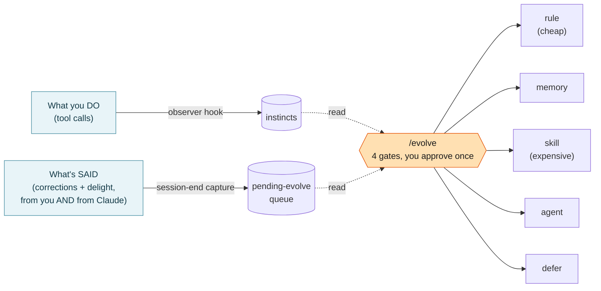

<div align="center">

# claude-code-self-evolution

English | [中文](README.zh-CN.md)

## *You correct Claude Code the same way every single time. And every single time, it forgets. What if it didn't?*

**A learning layer that turns your corrections into the rules, memory, and skills your agent actually keeps.**

No fine-tuning. No cloud. No weights touched. Just your real corrections and endorsements, compounding into the agent's instructions, gated by one human review.

[](LICENSE)
[](https://github.com/affaan-m/ECC)
[](https://docs.claude.com/en/docs/claude-code)

</div>

---

## What's new

> <details>
> <summary><sub><b>2026-07-20:</b> Sharper oversight. A large approval has to be genuinely readable; verification has to ask not just whether a check ran but whether it could have failed; and a confirmation gate should scale to the risk instead of firing on everything alike.</sub></summary>
>
> - **A large run now renders its approval surface as a page, not a chat table.** Past a few dozen proposed writes a table has no good setting: written out fully it is unreadable, compressed it leaves you approving a category label instead of a proposal. A page dissolves that, because a one-line summary and the full evidence behind it can both exist with you choosing which to look at. `/evolve` also gains a plain size rule for the chat fallback: cap a review surface at about seven rows, batch anything longer. See [docs/REVIEW-BOARD.md](docs/REVIEW-BOARD.md).
> - **The verify-before-claiming rule was split, because its enforcement hook was catching the wrong half.** The hook fires when the agent claims something is done or live with nothing to back it, and it works. But the failures that kept recurring were a different shape: a check *was* run and could not have come out the other way. That principle was already in the rule, as its last line, under two dozen accumulated examples. The rule now leads with the two shapes and a four-question test on your own check (layer, scope, timing, arbiter), with the accumulated examples demoted to evidence. The hook was extended at both layers, since messages of the second shape never reached its judge at all.
> - **A rule was narrowed rather than hardened, for the first time.** The triage model has always had three outcomes, and only two had ever fired. A confirmation gate meant for outward-facing actions was firing on the owner's own one-command-rollback deploys, adding a round trip and removing no risk. It is now calibrated by blast radius and reversibility, which is what an over-scoping diagnosis is supposed to produce.
>
> </details>
>
> <details>
> <summary><sub><b>2026-07-15:</b> The enforcement model learned to diagnose why a rule failed before deciding how to fix it, and the plan table learned to say what it is actually proposing.</sub></summary>
>
> - **The enforcement model was rebuilt: diagnose the failure, then match the fix to the rule's shape.** *Why* did a rule fail: never loaded (**plumbing**, fix delivery), loaded-but-ignored (**steerability**), or fired where it should not (over-scoping, narrow it)? Only a steerability failure gets a stronger home, and it is routed by shape rather than just "made harder": a mechanical check becomes a **deterministic hook**, a judgment call becomes a **prompt-hook** (a cheap model judges it live, not another line of prose), and a file-bounded rule becomes a **path-scoped rule**.
> - **The plan table shows what each proposal does and how strongly it is held.** A plain-language "what you're judging" column plus a confidence with its reason, so you approve an actual proposal, not a category label. Rows the agent feels lukewarm about are shown as low/medium for you to decide, never silently dropped.
> - **One `/evolve` now sweeps everything.** A single run covers your global queue and every project queue, no more `cd`-ing into each repo. You get one global plan table plus one table per project, each confirmed separately (never one blanket "yes" across scopes).
>
> </details>
>
> <details>
> <summary><sub><b>2026-06-27:</b> A framework no longer has to repeat itself to count.</sub></summary>
>
> - **Recurrence gating now applies to corrections only.** A behavioral correction still needs to happen twice before it becomes a rule, because once may be a slip. A transferable framework does not: it is a lens, not a flaky pattern, and it is worth keeping the first time it is articulated. Waiting for a second occurrence that may never come was silently dropping the highest-value signal the system exists to catch.
> - **Already-covered candidates no longer distort the promotion rate.** They are archives, not promotions, so they leave the base entirely. Rule promotion and memory promotion are also now measured separately, since a batch of frameworks is *supposed* to become memory.
>
> </details>

## The problem

Every coding session you teach your agent something: "don't put `!important` inline", "lead with the conclusion", "this codebase uses pnpm not npm". Then the session ends and all of it evaporates. Next week you type the same correction again.

Tools that fix this usually reach for fine-tuning (expensive, opaque, irreversible) or a giant always-on prompt (slow, and it drowns the signal). Both are the wrong size for "remember that I prefer X."

## The idea

Treat learning as **two cheap capture streams feeding one deliberate judgment**:

1. **Watch what you do.** A hook records tool-call patterns; a small observer model distills repeated ones into confidence-weighted **instincts**. (This engine is [ECC](https://github.com/affaan-m/ECC), vendored here.)
2. **Listen to the conversation, both sides.** Session-end skills capture the moments that matter, and not just yours: when you **corrected** Claude, when Claude **caught itself**, when you **endorsed** a move, when a framing **landed**. Correction and delight are each captured in two directions, from you and from Claude.

Both streams just dump candidates to a queue. Nothing becomes durable until **you run `/evolve`**, the single review surface that clusters every signal, routes each one through four gates, and writes whichever artifact fits: a rule, a memory entry, or a skill (preferring the cheapest one that does the job).



The phrase to remember: **capture is cheap and automatic, judgment is deliberate and rare.**

## Why it's different

Most self-evolving agents either retrain weights or auto-rewrite one prompt. This one is built on a few opinions the others don't share:

- **Capture and judgment are separated by design.** Two always-on streams notice things cheaply. One human-triggered surface decides. Your review burden batches into a single moment instead of a nag after every session.
- **Both polarities, both directions.** It captures corrections *and* endorsements, and not just yours: when Claude catches its own mistake (self-correction) or gets an aha from your framing, that counts too. Claude can read its own reasoning trace, so it flags patterns you never even noticed. Most systems only ever learn from explicit user feedback.
- **Routing is cost-aware.** A `rule` is a few lines of markdown loaded only when relevant. A `skill` costs system-prompt tokens in *every* session forever. `/evolve` prefers the cheapest reversible artifact and only escalates when it must: `rule < memory < skill < agent`.
- **Conflict is a veto, not an average.** One real counterexample refutes "this is globally true" and blocks promotion, no matter how many times the pattern agreed elsewhere. A learning system that only counts agreement quietly grows a self-contradictory ruleset.
- **Confidence moves on three axes.** Recurrence raises it, weekly decay lowers it, semantic conflict vetoes it. Stale lessons fade on their own.
- **The eval corpus is free.** Every accept/reject/defer you make at `/evolve` is logged. That log *is* the labeled dataset for grading whether the capture skills are too noisy. No separate eval harness.

See [docs/COMPARISON-OTHER-SYSTEMS.md](docs/COMPARISON-OTHER-SYSTEMS.md) for an honest table against Hermes, Sepo, the OpenAI cookbook, the self-evolving-agents survey, and EvoMap (including where the ideas overlap). In the survey's taxonomy (arXiv 2507.21046), this project sits at **Memory/Tools, evolved inter-test-time, from textual feedback, in a single-agent coding setting**: it deliberately avoids the heaviest routes (evolving weights or architecture) because only reversible behavioral instructions are worth letting an agent rewrite about itself.

## Quick start

```bash
git clone https://github.com/annexiao/claude-code-self-evolution.git
cd claude-code-self-evolution

bash install.sh --dry-run   # see exactly what it will copy
bash install.sh             # install into ~/.claude/
```

Then two manual steps the installer prints for you:

1. Merge `config/settings.example.json` into `~/.claude/settings.json` (wires the tool-call capture hook).
2. (optional) Schedule weekly confidence decay (launchd on macOS, cron on Linux).

> **Heads up: the observer is on by default.** Once the hook is wired, the first tool call in a project lazy-starts a background daemon that calls Claude Haiku to distill your tool-call patterns into instincts. That is the point of the tool, but it does spend Haiku tokens. To run with only the conversation-capture half, set `"enabled": false` under `observer` in `~/.claude/skills/continuous-learning-v2/config.json`.

Requirements: [Claude Code](https://docs.claude.com/en/docs/claude-code), the `claude` CLI on your PATH (the observer calls Claude Haiku), `git`, `python3`, and `jq` (for the review script).

## How you actually use it

| Moment | What happens | Who triggers it |
|---|---|---|
| During a session | The observer hook quietly records tool-call patterns | Automatic |
| End of a session | Run `/save-session`, and the capture skills scan the conversation for corrections + endorsements, dumping candidates to the queue | You (`/save-session`) |
| Every few weeks | Run `/evolve`. It clusters both streams, proposes routes, shows one table, you approve | You (`/evolve`) |
| Weekly, in the background | Unused instincts slowly decay in confidence | Automatic |

**The chain at session end** (`/save-session` runs these in order):

```
/save-session
   -> correction-capture   (you corrected Claude, or Claude self-corrected)
   -> delight-capture      (you endorsed a move, or a framing reframed someone)
```

Both are **dump-only**: they write candidate files and exit. They never interrupt you and never promote anything durable. That is `/evolve`'s job, later, with your sign-off.

## What's in the box

| Path | What it is | Origin |
|---|---|---|
| `skills/correction-capture/` | Captures corrections, two directions (you to Claude, Claude to itself) | This project |
| `skills/delight-capture/` | Captures endorsements + reframings, two directions | This project |
| `commands/evolve.md` | The cost-aware, four-gate `/evolve` judgment surface | This project (rewrite of ECC's) |
| `commands/save-session.md` | Saves session state and fires the capture chain. If you already have a save-session, the installer injects the chain into it instead | This project |
| `scripts/apply-instinct-decay.py` | Deterministic weekly confidence decay | This project |
| `scripts/verify-pending-evolve.sh` | Queue health check, run by `/evolve` | This project |
| `scripts/review-evolve-signals.sh` | Aggregates the decision log into capture-skill quality signals | This project |
| `engine/continuous-learning-v2/` | The instinct/observer engine (the tool-call stream) | [ECC](https://github.com/affaan-m/ECC), vendored |
| `docs/ARCHITECTURE.md` | The full single-source map, with diagrams | This project |

## Learn the design

- [docs/ARCHITECTURE.md](docs/ARCHITECTURE.md): the complete map. Capture layer, distill layer, judgment layer, output sinks, the four gates, the eval loop, and the six design philosophies. Start here if you want to understand or fork it.
- [docs/COMPARISON-WITH-ECC.md](docs/COMPARISON-WITH-ECC.md): exactly what this adds on top of ECC, and why.
- [docs/COMPARISON-OTHER-SYSTEMS.md](docs/COMPARISON-OTHER-SYSTEMS.md): how it sits among other self-evolving agent projects.

## Credits

Built on [ECC (everything-claude-code)](https://github.com/affaan-m/ECC) by Affaan Mustafa (MIT). The instinct/observer engine is entirely ECC's design; this project adds the conversation-capture streams and the cost-aware, conflict-vetoing judgment layer on top. If you only want the tool-call learning engine, use ECC directly.

## License

MIT. See [LICENSE](LICENSE) and [NOTICE](NOTICE).
