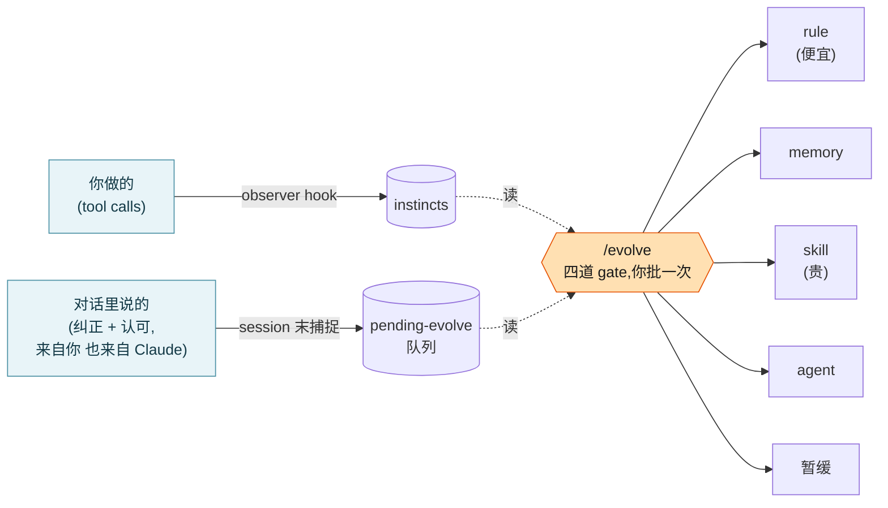

<div align="center">

# claude-code-self-evolution

[English](README.md) | 中文

## *同一个纠正,你每次都要重新说一遍。而它每次都忘。如果它不忘呢?*

**一个学习层,把你的纠正变成 agent 真正会记住的 rules、memory 和 skills。**

不 fine-tune,不上云,不动一个权重。只用你真实的纠正和认可,复利到 agent 的指令里,最后由一次人工 review 把关。

[](LICENSE)
[](https://github.com/affaan-m/ECC)
[](https://docs.claude.com/en/docs/claude-code)

</div>

---

## 问题

每次写代码,你都在教 agent 一点东西:"别把 `!important` 写进 inline"、"先说结论"、"这个 codebase 用 pnpm 不用 npm"。然后 session 一结束,全蒸发了。下周你又把同一句纠正打一遍。

想解决这个的工具,通常要么去 fine-tune(贵、黑箱、不可逆),要么塞一个巨大的常驻 prompt(慢,而且把信号淹了)。对"记住我喜欢 X"这件事来说,两个都太重。

## 想法

把学习拆成 **两条便宜的捕捉流,喂给一次审慎的判断**:

1. **看你做了什么。** 一个 hook 记录 tool-call 的模式,一个小的 observer model 把反复出现的模式蒸馏成带置信度的 **instincts**。(这个引擎是 [ECC](https://github.com/affaan-m/ECC),已 vendored 进来。)
2. **听对话,两边都听。** session 结束时的 skills 捕捉真正重要的瞬间,而且不只是你的:你 **纠正** Claude 的时候、Claude **自己发现错** 的时候、你 **认可** 某个做法的时候、某个 framing **说到点上** 的时候。纠正和认可各自都从两个方向捕捉,从你,也从 Claude。

两条流都只是把候选 **dump 进一个队列**。在你 **跑 `/evolve`** 之前,没有任何东西会变成持久的。`/evolve` 是唯一的 review 界面:它把所有信号聚类,让每条过四道 gate,再写成最合适的 artifact,rule、memory 还是 skill(优先选最便宜、够用的那个)。



一句话记住它:**捕捉是便宜且自动的,判断是审慎且稀有的。**

## 为什么它不一样

大多数 self-evolving agent 要么重训权重,要么自动改写某一个 prompt。这个不一样,它站在几个别人不认的观点上:

- **捕捉和判断,是被刻意分开的。** 两条常驻流便宜地留意一切。一个由人触发的界面来决定。你的 review 负担被 **攒成一个时刻**,而不是每个 session 后都来烦你一次。
- **两种极性,两个方向。** 它同时捕捉纠正 **和** 认可,而且不只是你的:Claude 抓到自己的错(self-correction)、或者被你的 framing 点醒(aha),都算。Claude 能读自己的 reasoning trace,所以它会标出连你都没注意到的模式。多数系统永远只从显式的用户反馈里学。
- **路由是 cost-aware 的。** 一条 `rule` 是几行 markdown,只在相关时才加载。一个 `skill` 会在 **每个** session 里永远吃掉 system-prompt 的 token。`/evolve` 优先选最便宜、可逆的 artifact,非升不可才升:`rule < memory < skill < agent`。
- **冲突是一票否决,不是取平均。** 一个真实的反例,就能推翻"这条全局成立",挡下 promotion,不管这个模式在别处认同了多少次。一个只会数认同的学习系统,会悄悄养出一套自相矛盾的 ruleset。
- **置信度在三个轴上动。** 复现拉高它,每周 decay 拉低它,语义冲突否决它。过时的教训会自己淡出。
- **eval 语料是白来的。** 你在 `/evolve` 里每一次 accept / reject / defer 都被记下来。那份 log **就是** 用来评判捕捉 skills 是不是太吵的标注数据集。不需要单独的 eval harness。

想看诚实的对比,见 [docs/COMPARISON-OTHER-SYSTEMS.md](docs/COMPARISON-OTHER-SYSTEMS.md):对 Hermes、Sepo、OpenAI cookbook、self-evolving-agents 综述、EvoMap 的逐项对照(也写清了哪里想法重叠)。用综述的分类法(arXiv 2507.21046)说,这个项目处在 **Memory/Tools、inter-test-time 演化、来自 textual feedback、single-agent coding 场景**:它刻意避开最重的那几条路(演化权重或架构),因为只有可逆的行为指令,才值得让一个 agent 去改写关于它自己的东西。

## 最近更新

**2026-07-15:enforcement 模型和 `/evolve` 的增强。**

- **enforcement 模型重建了:先诊断失效,再按规则的形状匹配修法。** 规则*为什么*失效:从没被加载(**plumbing**,修的是投递)、加载了却被忽略(**steerability**)、还是在不该触发的场景上误触发(over-scoping,收窄它)?只有 steerability 才需要更强的 home,而且是按形状路由、而不是一律"改得更硬":可机械检查的 → **deterministic hook**,判断类的 → **prompt-hook**(便宜模型现场判,而不是再加一行 prose),限定某类文件的 → **path-scoped rule**。
- **plan 表现在会写清每条提议在做什么、有多确信。** 一个大白话的 "你在判断什么" 列,加上一个带理由的 confidence,所以你批准的是一条真实的提议,不是一个分类标签。agent 拿不太准的行会以 low/medium 显示交给你判断,绝不悄悄丢掉。
- **一个 `/evolve` 现在扫全部。** 一次运行覆盖你的全局队列和每一个 project 队列,不用再 `cd` 进每个 repo。你会看到一个全局 plan 表加上每个 project 一个表,各自单独确认(绝不用一个笼统的 "yes" 跨所有 scope)。

## Quick start

```bash
git clone https://github.com/annexiao/claude-code-self-evolution.git
cd claude-code-self-evolution

bash install.sh --dry-run   # 先看它到底会 copy 什么
bash install.sh             # 装进 ~/.claude/
```

然后是安装器会替你打印出来的两个手动步骤:

1. 把 `config/settings.example.json` 合并进 `~/.claude/settings.json`(接上 tool-call 捕捉 hook)。
2. (可选)排一个每周的 confidence decay(macOS 用 launchd,Linux 用 cron)。

> **提醒:observer 默认是开的。** hook 一接上,某个项目里的第一个 tool call 就会 lazy-start 一个后台 daemon,它会调 Claude Haiku 把你的 tool-call 模式蒸馏成 instincts。这正是这工具的意义,但它确实会花 Haiku 的 token。想只跑对话捕捉那一半,把 `~/.claude/skills/continuous-learning-v2/config.json` 里 `observer` 下的 `"enabled"` 设成 `false`。

依赖:[Claude Code](https://docs.claude.com/en/docs/claude-code)、PATH 上的 `claude` CLI(observer 要调 Claude Haiku)、`git`、`python3`、还有 `jq`(review 脚本要用)。

## 你实际怎么用它

| 时刻 | 发生什么 | 谁触发 |
|---|---|---|
| session 进行中 | observer hook 悄悄记录 tool-call 模式 | 自动 |
| session 结束时 | 跑 `/save-session`,捕捉 skills 扫一遍对话,找纠正 + 认可,把候选 dump 进队列 | 你(`/save-session`) |
| 每隔几周 | 跑 `/evolve`。它把两条流聚类、提路由、给你一张表,你批 | 你(`/evolve`) |
| 每周,后台 | 没被用到的 instincts 慢慢 decay 掉置信度 | 自动 |

**session 末的链条**(`/save-session` 按顺序跑这些):

```
/save-session
   -> correction-capture   (你纠正了 Claude,或 Claude 自我纠正)
   -> delight-capture      (你认可了某个做法,或某个 framing 点醒了谁)
```

两个都是 **dump-only**:只写候选文件然后退出。它们从不打断你,也从不 promote 任何持久的东西。那是 `/evolve` 的活,晚点做,带你的签字。

## 盒子里有什么

| 路径 | 是什么 | 来源 |
|---|---|---|
| `skills/correction-capture/` | 捕捉纠正,两个方向(你对 Claude,Claude 对自己) | 本项目 |
| `skills/delight-capture/` | 捕捉认可 + reframing,两个方向 | 本项目 |
| `commands/evolve.md` | cost-aware、四道 gate 的 `/evolve` 判断界面 | 本项目(重写自 ECC 的) |
| `commands/save-session.md` | 保存 session 状态并触发捕捉链。如果你已经有 save-session,安装器会把链条注进你现有的那个 | 本项目 |
| `scripts/apply-instinct-decay.py` | 确定性的每周 confidence decay | 本项目 |
| `scripts/verify-pending-evolve.sh` | 队列健康检查,`/evolve` 会跑 | 本项目 |
| `scripts/review-evolve-signals.sh` | 把决策 log 聚合成捕捉 skill 的质量信号 | 本项目 |
| `engine/continuous-learning-v2/` | instinct/observer 引擎(tool-call 那条流) | [ECC](https://github.com/affaan-m/ECC),vendored |
| `docs/ARCHITECTURE.md` | 完整的单一来源地图,带图 | 本项目 |

## 读懂设计

- [docs/ARCHITECTURE.md](docs/ARCHITECTURE.md):完整地图。捕捉层、蒸馏层、判断层、输出 sink、四道 gate、eval 回路、还有六条设计哲学。想理解或 fork 它,从这里开始。
- [docs/COMPARISON-WITH-ECC.md](docs/COMPARISON-WITH-ECC.md):在 ECC 之上到底加了什么,为什么。
- [docs/COMPARISON-OTHER-SYSTEMS.md](docs/COMPARISON-OTHER-SYSTEMS.md):它在其他 self-evolving agent 项目里处在什么位置。

## 致谢

建立在 [ECC (everything-claude-code)](https://github.com/affaan-m/ECC) 之上,作者 Affaan Mustafa(MIT)。instinct/observer 引擎完全是 ECC 的设计;本项目在它上面加了对话捕捉的那几条流,以及 cost-aware、会否决冲突的判断层。如果你只想要 tool-call 学习引擎,直接用 ECC。

## License

MIT。见 [LICENSE](LICENSE) 和 [NOTICE](NOTICE)。
