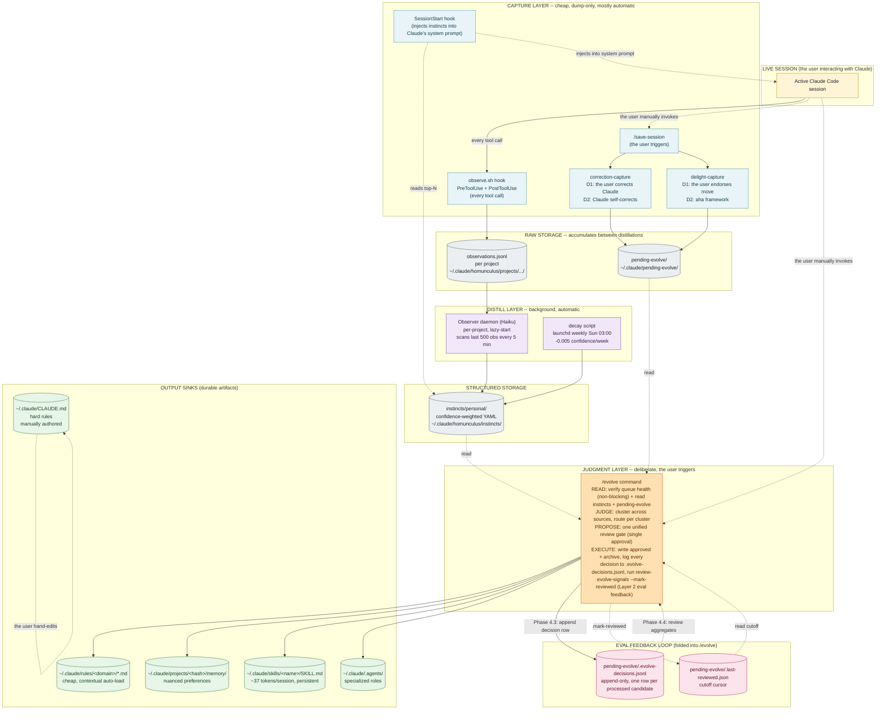
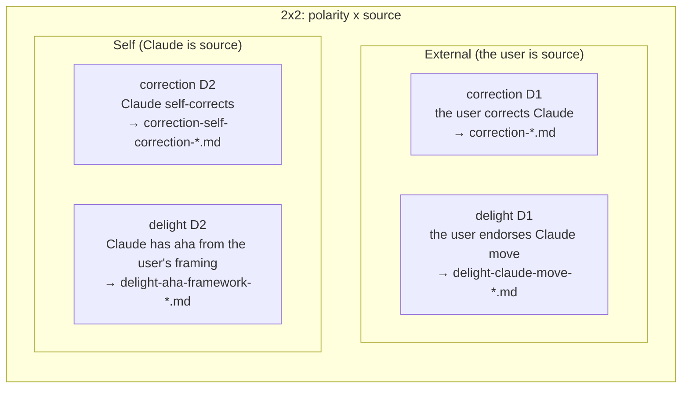
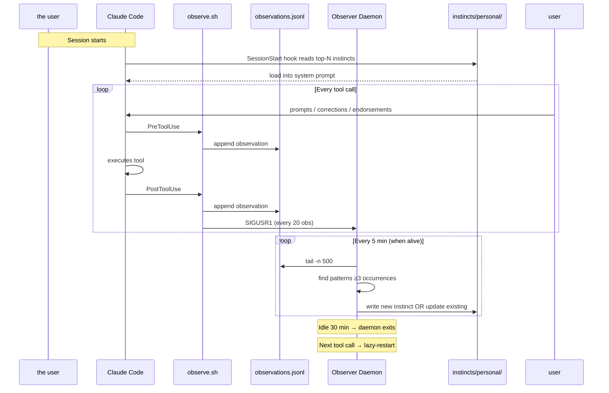
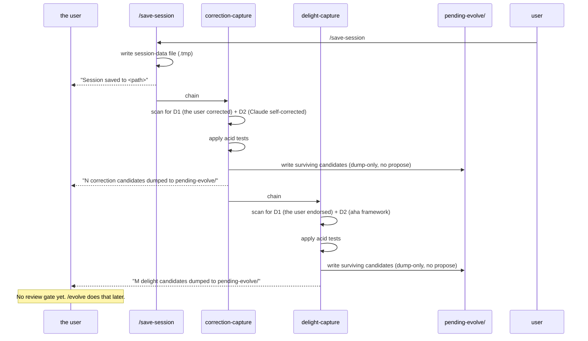
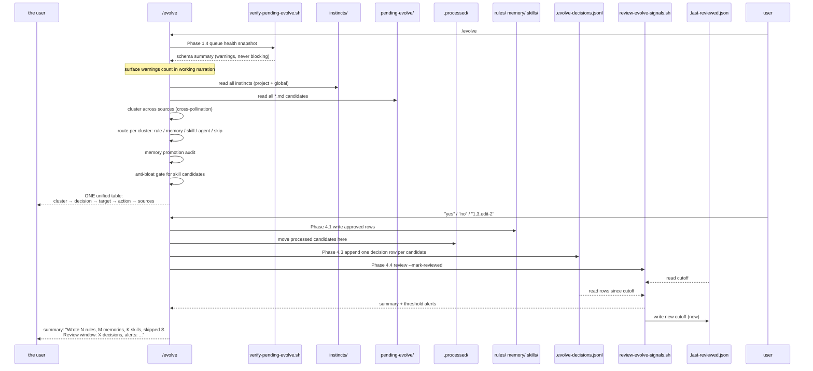

# Claude Code Self-Evolution Architecture

**Status:** Operational. Routing modes + `routing_confidence` gating (see "Routing modes & confidence gating"); eval pipeline (Layer 1 verify + Layer 2 decision log + review) folded into `/evolve`.

This document is the single-source map of the continuous-learning + memory + rules system. When you (or a future Claude session) need to understand how a captured signal becomes a persistent rule, start here.

> Built on top of [ECC (everything-claude-code)](https://github.com/affaan-m/ECC) by Affaan Mustafa (MIT). The instinct/observer engine is ECC's; the capture-vs-judgment layer, the four-gate routing, the correction/delight capture skills, and the cost-aware `/evolve` rewrite are this project's additions. See [COMPARISON-WITH-ECC.md](COMPARISON-WITH-ECC.md) for the precise diff.

> **Governance (non-negotiable):** any change to the evolution machinery, `/evolve` routing / modes / confidence, the capture skills (correction-capture / delight-capture), continuous-learning-v2, or the `pending-evolve` schema/conventions, MUST update this document in the same change set. The doc is the source of truth; code changing without the map changing means the next session reasons from a stale map.

---

## What this system does (one paragraph)

Your Claude environment has several parallel channels for capturing learning signal during sessions, two storage tiers (raw observation vs structured candidate), one background distillation process (the Haiku observer agent), and one judgment surface (`/evolve`) that converges all signal streams into a single review gate and writes durable outputs to rules / memory / skills. The architecture follows a deliberate **capture-vs-judgment separation**: capture is cheap, dump-only, and happens automatically; judgment is deliberate, batched, and happens only when the user runs `/evolve`. As a load-bearing side benefit, `/evolve`'s accept/reject/defer decisions also serve as a free labeled corpus for evaluating upstream capture-skill quality, the eval pipeline is folded directly into `/evolve` (Phase 1.4 schema inspector + Phase 4.4 review summarizer) rather than scheduled separately, because both layers only have new signal at `/evolve` time anyway.

---

## Design highlights

The distinctive ideas, before the dense map below:

- **One signal, many possible homes (cost-aware routing).** A captured lesson is not destined for a single fixed output. `/evolve` routes each one to whichever artifact actually fits: a global rule, a project rule, a memory entry, a skill, or an agent. Among the artifacts that would work, it prefers the cheapest reversible one (a rule, loaded only when relevant) over the most expensive (a skill, which costs system-prompt tokens every session forever): rule < memory < skill < agent. Cost is a first-class routing axis, not an afterthought. A terse "if-this-then-that" correction becomes a one-line rule; a genuine multi-step workflow earns a skill. Same pipeline, different home.
- **Capture is cheap and automatic; judgment is deliberate and rare.** Two always-on streams (tool-call instincts + session-end conversation capture) only dump candidates to queues. Nothing becomes durable until you run `/evolve`. Your review burden batches into one moment instead of a prompt after every session.
- **Both polarities, both directions.** The conversation stream captures corrections AND endorsements, and each in two directions: from you (you corrected Claude, you endorsed a move) and from Claude itself (it caught its own pattern, or got an aha from your framing). Claude can read its own reasoning trace, so it surfaces lessons you never noticed. This 2x2 capture matrix (polarity x source) is most systems' blind spot: they only learn from explicit user feedback.
- **Conflict is a veto, not an average.** One genuine counterexample refutes "this is globally true" and blocks promotion, no matter how many times the pattern agreed elsewhere. A system that only counts agreement quietly grows a self-contradictory ruleset.
- **Confidence moves on three axes.** Recurrence raises it, weekly decay lowers it, semantic conflict vetoes it. Stale lessons fade on their own.
- **The eval corpus is free.** Every `/evolve` accept/reject/defer is logged, and that log is the labeled dataset for grading whether the capture skills are too noisy. No separate eval harness.

These are expanded in the cost hierarchy table and the six design philosophies near the end of this document.

## What this repo ships (and what it does not)

This document maps the full system as the author runs it. The open-source repo
ships the parts you need to reproduce it, and is explicit about the few pieces it
does not bundle:

**Bundled** (installed by `install.sh`): the two capture skills, a
`save-session` command that fires the capture chain in order (or, if you already
have a save-session, the installer injects the chain into yours), the cost-aware
`/evolve` command, the decay / verify / review scripts, and the vendored ECC
observer engine with its `PreToolUse` / `PostToolUse` hook.

**Not bundled, wire your own if you want it:**

- **The `SessionStart` instinct-injection hook** (the dotted "read top-N
  instincts into the system prompt" arrow in the diagram below). The repo
  captures and distills instincts, but does not ship a hook that re-injects them
  into every new session. Instincts are still read at `/evolve` time and by
  `instinct-cli.py status`. If you want them auto-injected at session start, add
  your own `SessionStart` hook that runs `instinct-cli.py` and prints the top-N.
- **`CLAUDE.md` hard rules** (output sink 5 below). Those are hand-authored by
  you; `/evolve` never writes them. The capture-chain order does NOT depend on
  `CLAUDE.md`: it lives in the shipped `save-session` command, so the system is
  self-contained.

**Placeholder paths:** where docs say `~/.claude/projects/<your-home-project>/memory/`,
`<your-home-project>` is the project bucket for your home directory. If you have
no specific home project, any stable path under `~/.claude/projects/.../memory/`
works; `/evolve` creates the directory on first write.

---

## The full architecture diagram



---

## Component glossary

### Capture layer (4 components)

| # | Component | Trigger | Output | Automatic? |
|---|---|---|---|---|
| 1 | **`observe.sh` hook** | Every `PreToolUse` + `PostToolUse` (tool call) | `observations.jsonl` in current project's bucket (or global fallback) | ✓ yes |
| 2 | **SessionStart hook** | Session boot | Reads top-N high-confidence instincts; injects them into Claude's system prompt | ✓ yes |
| 3 | **`correction-capture`** skill (D1 + D2) | `/save-session` | Candidate files in `~/.claude/pending-evolve/` (DUMP-ONLY) | ✓ on `/save-session` |
| 4 | **`delight-capture`** skill (D1 + D2) | `/save-session` (after correction-capture) | Candidate files in `~/.claude/pending-evolve/` (DUMP-ONLY) | ✓ on `/save-session` |

### Distill layer (2 components, auto)

| Component | Trigger | What it does | Where it writes |
|---|---|---|---|
| **Observer daemon** (Haiku LLM) | Lazy-start on first tool call in a project; runs every 5 min (or SIGUSR1 from observe.sh every 20 obs); idle-exits after 30 min inactivity | Reads last 500 observations; finds repeated patterns (≥3 occurrences); writes instinct YAML | `~/.claude/homunculus/instincts/personal/*.md` (global) or `<project>/instincts/personal/*.md` |
| **Decay script** | launchd weekly Sunday 03:00 | Reads each instinct YAML; computes `weeks_stale = (now - mtime) / week`; applies `confidence -= 0.005 × weeks_stale`; floors at 0 | Same files (updates `confidence:` line) |

### Judgment layer (1 component, manual)

| Component | Trigger | What it does | Where it writes |
|---|---|---|---|
| **`/evolve` command** | the user invokes (suggested cadence: every few months, or when `/instinct-status` feels noisy) | **READ:** runs `verify-pending-evolve.sh` informationally (queue health, never blocks), reads both `instincts/personal/` and `pending-evolve/`; **JUDGE:** clusters across sources, routes per cluster to rule / memory / skill / agent / skip, runs the memory promotion audit (project → global if same topic in ≥2 projects); **PROPOSE:** presents ONE unified review surface (one go/skip per table); **EXECUTE:** writes approved rows + archives processed candidates to `.processed/`, appends one decision row per candidate to `.evolve-decisions.jsonl`, runs `review-evolve-signals.sh --mark-reviewed` and surfaces any threshold alerts | `~/.claude/rules/`, memory dirs, `~/.claude/skills/`, `~/.claude/.agents/`, `.evolve-decisions.jsonl`, `.last-reviewed.json` |

### Output sinks (5 destinations)

| Sink | What goes here | Cost | Lifecycle |
|---|---|---|---|
| **`~/.claude/CLAUDE.md`** | Hard absolute rules (dummy examples only: `never force-push`, `prefer tabs`) | Loaded into system prompt every session | Manually authored by the user; `/evolve` does NOT write here |
| **`~/.claude/rules/<domain>/*.md`** | Persistent "if-this-then-that" principles | Loaded contextually when relevance matches | `/evolve` appends / modifies / skips |
| **`~/.claude/projects/<hash>/memory/feedback_*.md`** | Nuanced preferences, frameworks, calibration signals | Loaded with project context | `/evolve` writes (with optional project→global promotion) |
| **`~/.claude/skills/<name>/SKILL.md`** | Multi-step workflows the user explicitly invokes via `/<name>` | ~37 tokens of system-prompt overhead every session forever | `/evolve` writes only if anti-bloat gate passes (no existing similar skill + ≥3 steps + user-invokable) |
| **`~/.claude/.agents/<name>.md`** | Complex specialized roles needing own context window | Per-invocation context cost | `/evolve` writes rarely; high bar |

---

## The 2x2 capture matrix (correction + delight)



All four go to `~/.claude/pending-evolve/`. `/evolve` clusters across all four types + cross-pollinates with tool-call instincts.

### Acid tests (filter quality)

| Type | Acid test |
|---|---|
| correction D1 | Systemic preference (not one-off fact); can articulate underlying rule in 1-2 sentences |
| correction D2 | Specific behavior (not generic); articulatable as future-checkable rule; about a pattern (not just incident) |
| delight D1 | Could describe the Claude move in 1-2 sentences such that Claude could replicate it in a different context |
| delight D2 | Did the source name a blind spot the other party didn't see, OR propose a framing the other party adopts? |

---

## Data flow: what happens during a session



## Data flow: what happens at `/save-session`



## Data flow: what happens at `/evolve`



---

## Cost hierarchy (why /evolve defaults to cheaper artifacts)

From cheapest to most expensive (in per-conversation token cost forever):

| Artifact | Cost mechanism | Approximate cost per session |
|---|---|---|
| **rule** (`~/.claude/rules/<domain>/*.md`) | Loaded only when context matches | 0 baseline, small spike when relevant |
| **memory** (`~/.claude/projects/.../memory/*.md`) | Loaded when project context matches | Same as rule, project-conditional |
| **CLAUDE.md** | Loaded every session | A few hundred tokens, but the user curates manually |
| **command** (`~/.claude/commands/*.md`) | Description in slash-command listing | ~10 tokens per command |
| **skill** (`~/.claude/skills/<name>/SKILL.md`) | Description in skill registry | ~37 tokens × every session forever |
| **agent** (`~/.claude/.agents/<name>.md`) | Per-invocation full context | Variable, can be heavy |

`command` and `CLAUDE.md` are listed here for cost comparison only. `/evolve` does NOT route to them: its decision tree writes **rule / memory / skill / agent** (or defers). `CLAUDE.md` hard rules are authored by you by hand; commands are not a promotion target.

**`/evolve` decision tree biases toward rule and memory** because:
- Reversing a rule = deleting one bullet
- Reversing a memory = deleting one file
- Reversing a skill = deleting a file AND living with already-paid token cost
- Reversing an agent = same as skill, plus discoverability issues

This is a **deliberate cost-aware default**. Source: 2026-05-22 design discussion ("default to cheaper artifacts" framework).

---

## Routing modes & confidence gating (added 2026-05-25)

`/evolve` is no longer a single global flow. It runs in one of three modes, and a `routing_confidence` gate governs what becomes durable. Canonical spec lives in `~/.claude/commands/evolve.md` ("Routing modes & confidence gating"); this is the map-level summary.

| Mode | Reads | Writes |
|---|---|---|
| **`/evolve inbox`** | all root candidates | nothing, classifies, stamps `routing_confidence`, moves high-confidence project-specific candidates to project queues, proposes |
| **`/evolve global`** (default) | high-confidence + cross-project-general or ≥2 recurrence | global rule / memory |
| **`/evolve project`** | current-repo candidates (by `project_id` / `git rev-parse`) | project rule / memory, only after explicit user confirmation |

Every candidate passes **four gates in sequence** (canonical spec in `evolve.md` "The four gates"). Failing a gate stops promotion; it is not retried at a higher tier.

| Gate | Question | Outcome |
|---|---|---|
| **1. Source** | Where did this come from? | Source facts recorded by capture (`project_id` / `captured_from_session` / `proposed_scope`). Unattributable → defer. root `pending-evolve/` is a neutral inbox; landing there confers nothing. |
| **2. Confidence** | How strong is the evidence? | `routing_confidence` high / medium / low, stamped by `inbox` (judgment, not capture). high = cross-project-general OR ≥2 *agreeing* projects OR the user meta-corrected. Only high proceeds; else defer. |
| **3. Conflict** | Counterexample or boundary conflict? | **A VETO, not a score.** Scan other projects + existing `rules/` for ¬X. Asymmetric: one genuine counterexample outweighs many agreements (it refutes universality). Any conflict **vetoes global promotion** → reclassify `context-dependent`. **Conflict with an existing global rule MUST be surfaced loudly**, never silently grow a self-contradictory ruleset; the user decides whether the old rule scopes down or the new one is context-specific. |
| **4. Scope** | global / project / context-dependent / defer? | cleared + high + cross-project + no conflict → **global**. high but project-specific, or conflict-vetoed → **project (context-dependent)**, only after user confirm. medium/low/unclear/unresolved-conflict → **defer**. `inbox` proposes the outcome but writes nothing. |

**Confidence has three change-axes, not one:** recurrence-agreement raises it (gate 2), staleness lowers it (weekly decay script), and **semantic conflict vetoes global promotion outright** (gate 3), conflict is not a slow decrement like decay, it's a hard stop, because a single counterexample refutes "globally true."

**Why:** previously capture dumped everything to one root queue and `/evolve` treated it all as global candidates, counting only *agreement* and never *contradiction*, risking project-specific candidates becoming global, and the ruleset silently growing internal contradictions. The four gates make **default defer** the safe baseline and make conflict a first-class veto. Source: 2026-05-25 routing-layer + four-gate design discussion.

This adds a sixth design philosophy (below): **default defer; root ≠ global; conflict vetoes, it doesn't average.**

---

## Eval pipeline (Layer 2 feedback loop folded into /evolve)

The /evolve gate is also an eval surface for upstream capture-skill quality. Three conceptual layers, only the first two are implemented:

| Layer | What it checks | When | How | Status |
|---|---|---|---|---|
| **1, Shell schema** | Field presence, filename format, type/direction consistency, project_id non-empty | `/evolve` Phase 1.4 | `verify-pending-evolve.sh`, informational, never blocks | ✓ implemented |
| **2, Judgment core** | Accept / reject / defer rates per `skill_source`; top reject reasons; threshold alerts when same reason ≥ 10× | `/evolve` Phase 4.4 (after writes + log) | `review-evolve-signals.sh --mark-reviewed` aggregates from `.evolve-decisions.jsonl` | ✓ implemented |
| **3, Longitudinal lift** | Did memory entries change Claude's behavior cross-session? Did the user's correction rate drop month-over-month? | Not yet implemented (revisit if Layer 2 alerts plateau) | Manual review when desired | (deferred) |

### Per-run routing review report + safety thresholds (Phase 3.3 to 3.4, added 2026-05-25)

Complementing the cross-run Layer-2 aggregate, every `/evolve` run emits a **per-run Routing Review Report** before writing:

- a **per-candidate table**: candidate_id, source_project/session, proposed_scope, routing_confidence, conflict_scan_result, final_route, reason, user-confirm-required
- a **5-candidate random audit sample**: original text + full metadata + routing decision + reason (spot-check that routing matches content)
- six **run metrics**: `rule_promotion_rate`, `memory_promotion_rate`, `defer_rate`, `conflict_surfaced_count`, `project_specific_confirmation_count`, `user_correction_count` (rule-promotion and memory-promotion are separate rates: the 30% guard is about *rule* bloat, whereas frameworks-to-memory is the designed path and is not gated)

Four **safety thresholds gate the write step** (a trip pauses or downgrades, never silently proceeds):

1. `rule_promotion_rate > 30%` → PAUSE + explain (a batch promoting >~30% to global *rules* is suspect; the global rule bar should rarely clear that many at once). `memory_promotion_rate` is NOT subject to this gate: frameworks-to-memory is the designed path, so a framework-heavy batch legitimately shows high memory promotion.
2. all conflict scans `none` but candidates span ≥2 projects → flag for re-check (zero conflict across a multi-project batch usually means a shallow scan).
3. project-specific candidate without user confirmation → hard block on project rule/memory write.
4. confidence not explainable in one sentence → default `defer`.

Lightweight by design: inline in `evolve.md` Phase 3.3 to 3.4, no new script, no capture-skill change. Guards on the four gates, not replacements. **Distinction:** Phase 3.3 to 3.4 = per-run routing transparency + pre-write safety; Phase 4.4 = cross-run accept/reject/defer aggregate for capture-skill quality. Canonical spec: `evolve.md` "Phase 3.3 to 3.4".

### Known review false-positive: convergence-reject vs noise-reject (recorded 2026-05-25)

`review-evolve-signals.sh` alerts when any `decision_reason` recurs ≥ threshold (default 10). But **`"covered by existing rule"` is benign when it reflects cross-source convergence**, the instinct stream and the conversation stream independently learning the same truth, which then dedups at /evolve. That is the system working, not a producer-quality defect. The alert's default recommendation ("tighten the producing skill's acid test") applies to *noise* rejects like `"too narrow"`, NOT to convergence dedup.

Worked instance: the 2026-05-25 instinct run rejected 10 instincts as `"covered by existing rule"` (several covered by rules written from captures the same session). The ≥10 alert fired and was **classified benign / convergence-reject by the user** (annotation row in `.evolve-decisions.jsonl`). No acid-test change warranted.

**Future improvement (not yet built):** `review-evolve-signals.sh` should split `"covered by existing rule"` into **convergence-duplicate** (benign, both channels found it; expected in a cross-source system) vs **noisy-duplicate** (a producer keeps re-emitting something already ruled, actionable). Only the latter should alert. Until then, treat a `covered-by-existing-rule` alert as benign-by-default and confirm by eyeball.

### The architectural insight: judgment IS the eval surface

Layer 2 works because /evolve already has to make an accept/reject/defer decision per candidate. **That decision is the same labeling task you'd otherwise need to crowdsource for an eval corpus.** By logging the decision stream to `.evolve-decisions.jsonl` (Phase 4.3), the labeled corpus accumulates as a free side effect of normal use. No external testing infrastructure needed; no separate annotation pass.

This is the architectural payoff of capture-vs-judgment separation. The separation was originally proposed for UX reasons (batch the user's review burden at one moment rather than per-skill). But the separation also concentrates ALL judgment decisions through a single gate, and once they're concentrated, logging them is cheap and the log IS the labeled corpus.

### How the loop closes itself

```
pending-evolve/ → /evolve reads (Phase 1) → routes per candidate (Phases 2 to 3)
 ↓
 writes: rule / memory / skill / agent / skip (Phase 4.1)
 ↓
 logs: .evolve-decisions.jsonl row per decision (Phase 4.3)
 ↓
 Phase 4.4: review-evolve-signals --mark-reviewed aggregates → threshold alert if reject_reason ≥ 10×
 ↓
 surfaces in final /evolve summary → the user sees "correction-capture's 'too narrow' reject pattern repeating"
 ↓
 the user manually tightens correction-capture/SKILL.md acid test
 ↓
 next capture pass produces less noise → next /evolve has fewer "too narrow" rejects
```

The loop closes itself: review surfaces evidence, the user updates the SKILL.md prose, future capture is tighter. No external monitoring, no scheduled jobs, no hidden state.

### Why folded into /evolve (not scheduled separately)

Earlier proposals considered (a) a SessionStart hook running verify on every session boot, and (b) a weekly launchd job running the review summary. Both rejected. The reasoning:

- **Verify only matters at /evolve time.** Schema drift in `pending-evolve/*.md` has zero downstream effect until /evolve reads those files. Running verify in sessions where /evolve will never be invoked pays cost without proportional value.
- **Review only has new signal when /evolve runs.** `.evolve-decisions.jsonl` only grows when /evolve appends rows. A weekly review run in a week where /evolve was invoked zero times produces the same report as last week.

Both scripts are **user-pull, not clock-push**. Their natural cadence is "whenever /evolve runs." Folding them into /evolve Phases 1.4 and 4.4 gives:

- Single user-touched surface (no hidden timers / launchd state to maintain)
- Eval signal timing aligned with new-data timing
- Zero background processes
- Simpler architecture doc

The scripts remain runnable standalone (for ad-hoc inspection), but `/evolve` is the canonical trigger.

### Schema of `.evolve-decisions.jsonl` (the labeled corpus format)

```jsonl
{"candidate_file":"correction-foo-20260522-173500.md","skill_source":"correction-capture","decision":"accepted","decision_reason":"cross-source cluster","tags":["type=correction","direction=D1","topic=foo","scope=global"],"confidence":0.9,"evolve_session_at":"2026-05-23T15:30:00Z"}
```

All timestamps are UTC Z-form (load-bearing, review script uses `jq fromdate` which only parses Z-form). Schema is forward-extensible; new fields can be added without breaking the review script.

The `decision_reason` field uses canonical short phrases (`"too narrow"`, `"performative self-criticism"`, `"singleton awaiting cluster"`, etc.) rather than freeform prose, so aggregation by reason works. Full canonical set is documented in `~/.claude/commands/evolve.md` Appendix A.

### Enforcement debt: triage first, then fork by mechanizability (added 2026-07-15)

A candidate rejected as `"covered by existing rule"` is not always noise. When the rule was in context and the same failure happened anyway, that recurrence-despite-a-rule is the highest-value signal that a rule is prose-in-name-only. `/evolve` mines these rows for **enforcement debt**: on every covered row it stamps `mapped_rule_clause` (which sub-clause was duplicated) and `would_have_prevented` (a counterfactual: would that rule, if actually followed, have stopped this failure?). Debt per clause is the count of `would_have_prevented=yes` rows for that clause, **split by the triage cause below and windowed** (added 2026-07-25). Only the **steerability** count drives a hook graduation; plumbing routes to a loading fix and over-scoping to a narrowing, so a clause at threshold on plumbing/over-scoping rows must NOT be proposed for a hook. And once a clause's root cause is fixed, a `decision:"annotation"` row carrying `resolves_clause` records it, and the tally then counts only rows dated AFTER that annotation, so a fixed cause ages out instead of accumulating forever on stale rows. A clause whose projected **steerability** debt reaches ~3 to 4 becomes a **graduation candidate**, surfaced for the user to approve; `/evolve` never auto-rewrites a rule. (The tally lives in the operative READ/JUDGE steps, not only in this design note: the triage split and the window are what those steps compute, not a discipline the reader has to remember.)

An earlier design used a single "make the rule harder" ladder. It was falsified on 2026-07-09 and replaced with a **two-step triage-then-fork model**:

**Step 1, triage the failure (debt is 3-dimensional, not a scalar).** The same symptom ("rule violated") has three causes that need opposite fixes:

| Cause | Signature | Fix direction |
|---|---|---|
| **Plumbing** | the rule was never IN context that turn (evicted, not reloaded after compaction) | fix LOADING, not the rule |
| **Steerability** | the rule was in context, acknowledged, and ignored anyway | move to a real enforcement point (Step 2) |
| **Over-scoping** | the rule fired on a legitimately-different case (recurrence with no real harm) | DE-escalate: narrow the trigger or demote severity |

Only **steerability** debt escalates. Plumbing routes to a loading fix; over-scoping routes to a narrowing proposal. Misclassifying either as steerability is how a system over-hardens rules that were never the problem.

**Step 2, for steerability debt, fork by mechanizability** (not one ladder):

| Rule shape | Enforcement home |
|---|---|
| Deterministically checkable (banned phrase, file-exists) | deterministic hook / linter / permission-deny |
| Judgment, not mechanizable (is this claim backed by a real check?) | `prompt`-type or `agent`-type hook (a cheap model judges the rule text at each matching event), NOT another prose line |
| Bounded to a file type / domain | path-scoped rule (`paths:` frontmatter), loads only when relevant |
| Genuinely cross-cutting judgment | one sharp always-loaded line, backed by a prompt-hook if debt persists |

The key correction: a pure-judgment rule cannot be made deterministic, so compressing it to a shorter prose line and putting it back into the always-on prompt is the same "context, not enforcement" bucket that caused the recurrence. A prompt-hook gives the judgment call a real enforcement point without forcing false decomposition. A rule that is really N sub-behaviors is decomposed (hook the mechanizable parts, path-scope the bounded ones, leave only the irreducible-judgment core as prose), not climbed. Canonical spec: `~/.claude/commands/evolve.md` Appendix B.

Most heavier machinery (weighted/decayed debt scoring, adversarial regression suites, a meta-critic on `/evolve`'s own routing) is explicitly deferred until a concrete trigger fires: at solo scale, small-N scoring is statistical theater and the upkeep lands on one person. This is the same build-vs-preserve restraint the system applies to itself.

---

## File structure

```
~/.claude/
├── ARCHITECTURE.md ← this file
├── CLAUDE.md ← hard rules, the user hand-authored
├── settings.json ← hooks configured here (the harness contract)
├── rules/ ← /evolve writes here (rule output)
│ ├── common/
│ ├── web/
│ ├── python/
│ ├── typescript/
│ ├── golang/
│ ├── swift/
│ ├── php/
│ └── zh/ (translations, /evolve skips)
├── skills/ ← /evolve writes here (skill output, gated)
│ ├── continuous-learning-v2/
│ │ ├── SKILL.md
│ │ ├── config.json (read by observe.sh and observer-loop.sh)
│ │ ├── hooks/observe.sh ← the capture hook
│ │ ├── agents/observer.md ← Haiku observer prompt (decay logic removed locally)
│ │ ├── agents/observer-loop.sh ← daemon main loop
│ │ ├── agents/start-observer.sh ← daemon launcher
│ │ └── scripts/instinct-cli.py ← status / export / import / evolve / promote / prune
│ ├── correction-capture/SKILL.md ← D1 + D2, dump-only
│ ├── delight-capture/SKILL.md ← D1 + D2, dump-only
│ ├── save-session/ ← the user triggers the chain
│ └── learned/ ← v1 legacy skills (still loaded)
├── commands/
│ └── evolve.md ← LOCAL OVERRIDE: cross-source cluster + promotion logic
├── .agents/ ← /evolve writes here (agent output, rare)
├── homunculus/ ← continuous-learning-v2 data dir
│ ├── README.md ← explains why "homunculus" not "continuous-learning"
│ ├── config.json ← observer.enabled, run_interval_minutes
│ ├── projects.json ← project hash registry
│ ├── observations.jsonl ← global-scope raw observations (fallback)
│ ├── instincts/
│ │ ├── personal/ ← auto-learned global instincts
│ │ └── inherited/ ← instinct-import target
│ ├── evolved/ ← legacy ECC /evolve --generate output (mostly unused locally)
│ └── projects/<12-char-hash>/ ← per-project bucket
│ ├── project.json
│ ├── observations.jsonl
│ ├── observations.archive/
│ ├── instincts/personal/
│ └── .observer.pid ← daemon PID file (lazy-managed)
├── pending-evolve/ ← LOCAL: conversation-signal candidate queue
│ ├── correction-*.md (D1 candidates)
│ ├── correction-self-correction-*.md (D2 candidates)
│ ├── delight-claude-move-*.md (D1 candidates)
│ ├── delight-aha-framework-*.md (D2 candidates)
│ ├── .evolve-decisions.jsonl ← Phase 4.3: append-only labeled corpus of /evolve decisions
│ ├── .last-reviewed.json ← Phase 4.4: cursor for review-evolve-signals.sh window
│ └── .processed/ ← /evolve archives processed candidates here
├── projects/
│ ├── <your-home-project>/memory/ ← "global" feedback memory (home-root project)
│ │ ├── MEMORY.md (index)
│ │ ├── feedback_*.md (correction-shaped)
│ │ ├── feedback_reinforce_*.md (delight D1)
│ │ ├── feedback_framework_*.md (delight D2)
│ │ ├── feedback_self_*.md (correction D2)
│ │ └── user_*.md (about the user personally)
│ └── <project-folder>/memory/ ← project-scoped feedback memory
├── scripts/
│ ├── apply-instinct-decay.py ← LOCAL: weekly decay (replaces Haiku prompt-based decay)
│ ├── verify-pending-evolve.sh ← LOCAL: Layer 1 schema inspector, invoked by /evolve Phase 1.4
│ ├── review-evolve-signals.sh ← LOCAL: Layer 2 review summarizer, invoked by /evolve Phase 4.4
│ └── hooks/ (hook helpers)
├── session-data/ ← /save-session writes session-state files here
│ └── YYYY-MM-DD-HHMM-*-session.tmp
├── logs/
│ └── instinct-decay.log ← launchd output for decay script
└── _archive/ ← old / superseded stuff (skill scanner doesn't read)
 ├── continuous-learning-v1/ (archived v1 skill)
 └── observer-patches/ (backup of original observer.md before decay removal)

~/Library/LaunchAgents/
└── com.user.instinct-decay.plist ← weekly Sun 03:00 schedule for decay script
```

---

## Where to look when X happens

| You want to ... | Look at |
|---|---|
| Understand why a hard rule is loading every session | `~/.claude/CLAUDE.md` |
| See what instincts are currently active | Run `/instinct-status` |
| Inspect a specific instinct's confidence | `~/.claude/homunculus/instincts/personal/<id>.md` |
| Find pending candidates waiting for `/evolve` | `ls ~/.claude/pending-evolve/` |
| Check observation flow / daemon state | `ls ~/.claude/homunculus/projects/<hash>/observations.jsonl` and `cat .observer.pid` |
| Adjust observer interval / threshold | `~/.claude/homunculus/config.json` |
| Adjust decay rate | `WEEKLY_DECAY` constant in `~/.claude/scripts/apply-instinct-decay.py` |
| Disable everything temporarily | `launchctl unload ~/Library/LaunchAgents/com.user.instinct-decay.plist` (decay) + `~/.claude/homunculus/disabled` file (observer) |
| Find a memory entry about a specific topic | `grep -ri "<topic>" ~/.claude/projects/*/memory/` |

---

## Local customizations vs upstream

Several pieces of this system are **local customizations** that diverge from upstream ECC (`affaan-m/ECC`). If the marketplace ever overwrites these files, re-apply from backups:

| File | What's customized | Backup |
|---|---|---|
| `~/.claude/skills/continuous-learning-v2/agents/observer.md` | Decay logic removed (delegated to Python script) | Local backup kept before the patch |
| `~/.claude/commands/evolve.md` | Cross-source clustering (instincts + pending-evolve); rule + memory as output channels; anti-bloat gate; single unified approval; memory promotion logic | Stored in this file's git history (when committed); also archived if needed |
| `~/.claude/skills/correction-capture/SKILL.md` | Local-only skill (not in upstream), D1 + D2 dump-only | n/a (local original) |
| `~/.claude/skills/delight-capture/SKILL.md` | Local-only skill (not in upstream), D1 + D2 dump-only | n/a (local original) |
| `~/.claude/scripts/apply-instinct-decay.py` | Local script for deterministic decay | n/a (local original) |
| `~/.claude/scripts/verify-pending-evolve.sh` | Layer 1 queue health inspector (informational, soft-mode) | n/a (local original) |
| `~/.claude/scripts/review-evolve-signals.sh` | Layer 2 review summarizer with threshold alerts | n/a (local original) |
| `~/Library/LaunchAgents/com.user.instinct-decay.plist` | Local launchd schedule | n/a (local original) |
| `~/.claude/homunculus/config.json` | `observer.enabled: true`, custom interval/threshold | n/a (this is config, regenerated by user) |
| `~/.claude/CLAUDE.md` "Skill chaining" section | Documents the capture chain + capture-vs-judgment separation | Stored in this file's git history |

Some of these (decay-split, rule output channel, conversation capture) are candidates for upstream PRs to ECC.

---

## The six design philosophies (informal)

1. **Capture is cheap, judgment is deliberate.** Don't make capture skills do judgment, they dump signal; `/evolve` decides. This batches the user's review burden at one moment.

2. **Cross-source convergence at the judgment layer.** Tool-call instincts and conversation-derived candidates land in different storage but converge at `/evolve`. Cross-pollination becomes possible, neither stream alone could see the cluster.

3. **LLM does pattern recognition, code does arithmetic.** Haiku finds patterns and reframes; Python applies fixed math (decay, file mtime comparisons). Don't ask an LLM to do deterministic computation.

4. **Default to the cheapest artifact.** Rule before memory before skill before agent. Reversibility cost matters more than convenience at write time.

5. **Judgment is the eval surface.** /evolve's accept/reject/defer decisions are themselves the labeled corpus for evaluating upstream capture-skill quality. Don't build a separate eval framework when the judgment stream already encodes the truth. Log the decisions, aggregate the patterns, surface the alerts, all folded into the same /evolve invocation that produces the writes. Eval cadence == judgment cadence; both are user-pull, not clock-push.

6. **Default defer; root ≠ global; conflict vetoes, it doesn't average.** The root `pending-evolve/` queue is a neutral inbox, not a global-candidate set. A candidate passes four gates, Source, Confidence, Conflict, Scope, to become durable. It reaches global only by clearing `routing_confidence: high` + cross-project + **no conflict**; it becomes a project rule/memory only after explicit confirmation; anything medium/low/unclear stays deferred. Critically, the system counts contradiction as well as agreement: a single genuine counterexample **vetoes** global promotion (it doesn't merely lower a score, one counterexample refutes "globally true"), and a candidate that conflicts with an existing global rule MUST be surfaced, never silently written. Without that, the ruleset slowly grows internal contradictions. The safe baseline is to keep, not to promote, reversing a wrong promotion (or untangling two contradictory rules) is more expensive than re-examining a deferred candidate next time.

---

## What's not in this system (explicit non-features)

- **Per-incident memory writes mid-session**: rejected as a design. Use `/save-session` chain.
- **Hard rules generated by `/evolve`**: rejected. Hard rules are the user's manual prerogative in `CLAUDE.md`.
- **UserPromptSubmit hook for conversation capture**: not yet implemented (would be Discussion #3 to ECC if pursued). Capture skills cover this gap via session-end batch.
- **Auto-delete of personal/ instincts at low confidence**: not implemented; manual `rm` is the cleanup mechanism. Pending instincts auto-delete at 30 days but personal ones don't.
- **Confidence threshold for `/evolve` to consider an instinct**: no hard floor; cluster size + cross-source evidence matters more than single-instinct confidence.
- **SessionStart hook running verify-pending-evolve.sh**: considered, rejected. Schema drift only matters at /evolve time; running on every session would pay cost without proportional value. Verify is folded into /evolve Phase 1.4 instead.
- **Weekly launchd job running review-evolve-signals.sh**: considered, rejected. Review only has new signal when /evolve has logged new decisions; running on a clock would produce stale repeats. Review is folded into /evolve Phase 4.4 instead.
- **Strict-mode verify-pending-evolve.sh that blocks /evolve**: considered, rejected. /evolve absorbs legacy-schema files via Claude's flexible markdown reading; strict schema enforcement at the verify layer would block legitimate processing. Verify runs informational, never blocks.
- **Legacy file migration / archival on schema change**: considered, rejected. When schema evolves, legacy files in `pending-evolve/` stay in place; the next /evolve absorbs and archives them to `.processed/` naturally. No manual cleanup step.

---

## How to extend

If you want to add a new capture channel (a third correction-style skill, a different signal source):

1. Decide where in the 2x2 matrix it sits (or whether it's a new dimension)
2. Write a SKILL.md that's **dump-only** (write to `~/.claude/pending-evolve/<type>-*.md`, don't propose, don't write to memory)
3. Include `project_id` / `project_name` in the candidate frontmatter via `detect-project.sh`
4. Update `~/.claude/CLAUDE.md` skill chain to include the new skill in the `/save-session` sequence
5. Update `~/.claude/commands/evolve.md` if your new candidate type needs special clustering or routing logic (otherwise it'll be picked up automatically by the existing `*.md` glob)

---

## Quick verify (7 commands)

```bash
# 1. Is the observer hook configured?
grep "observe.sh" ~/.claude/settings.json | head -5

# 2. Is the decay job scheduled?
launchctl list | grep instinct-decay

# 3. Are observer daemons running per-project?
ls ~/.claude/homunculus/projects/*/.observer.pid 2>/dev/null

# 4. What's in the pending-evolve queue right now?
ls ~/.claude/pending-evolve/*.md 2>/dev/null

# 5. Are recent instincts being updated?
ls -lt ~/.claude/homunculus/instincts/personal/ | head -5

# 6. Layer 1 queue-health snapshot (anytime, ad-hoc)
~/.claude/scripts/verify-pending-evolve.sh

# 7. Layer 2 decision-log review (anytime, ad-hoc, usually /evolve does this with --mark-reviewed)
~/.claude/scripts/review-evolve-signals.sh --all
```

If commands 1 to 5 return sensible output → core system is operational. Commands 6 to 7 are ad-hoc inspectors; the canonical trigger for both is `/evolve` Phases 1.4 and 4.4.
